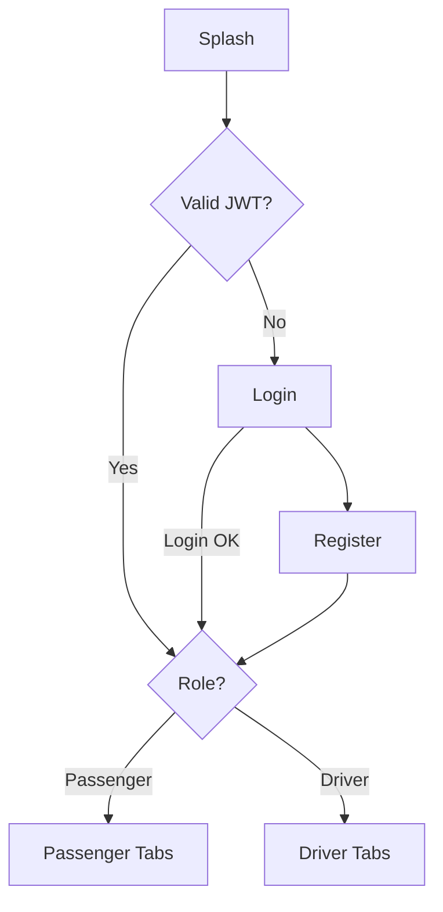
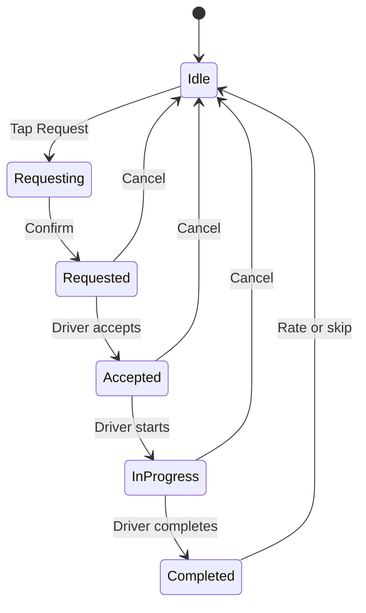
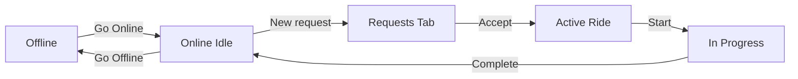

# Software Requirements Specification (SRS)

## CampusRide — Mobile Application


| Field                | Value                                                |
| -------------------- | ---------------------------------------------------- |
| **Document Version** | 1.2                                                  |
| **Date**             | June 7, 2026                                         |
| **Project**          | Real-Time Campus Mobility & Ride Management Platform |
| **Platform**         | Mobile (iOS & Android)                               |
| **Status**           | Draft                                                |


---

## Table of Contents

1. [Introduction](#1-introduction)
2. [Feature Scope Decision](#2-feature-scope-decision)
3. [Overall Description](#3-overall-description)
4. [User Roles & Personas](#4-user-roles--personas)
5. [Functional Requirements](#5-functional-requirements)
6. [Non-Functional Requirements](#6-non-functional-requirements)
7. [System Interfaces](#7-system-interfaces)
8. [Data Requirements](#8-data-requirements)
9. [Assumptions & Constraints](#9-assumptions--constraints)
10. [Release Plan](#10-release-plan)
11. [User Flow & Navigation](#11-user-flow--navigation)
12. [Appendix](#12-appendix)

---

## 1. Introduction

### 1.1 Purpose

This Software Requirements Specification defines the functional and non-functional requirements for **CampusRide Mobile** — a native mobile application that connects campus passengers with e-rickshaw drivers in real time.

The mobile app will consume the existing CampusRide backend (REST API + WebSocket) built for the IIT Roorkee–style campus mobility challenge, while adding mobile-first capabilities such as GPS, push notifications, and on-the-go driver workflows.

### 1.2 Scope

**In scope (Mobile v1.0):**

- All **Must Have** features (F-01 – F-17)
- All **Should Have** features (F-18 – F-23)
- Passenger and driver flows in a single role-based app
- GPS, push notifications, maps, profile edit, offline handling

**In scope (Mobile v1.1 — Could Have):**

- Ride scheduling (F-24)
- Advanced demand analytics on driver Analytics tab (F-26)

**Out of scope:**

- Admin web portal
- Real payment gateway integration
- ML demand forecasting
- Multi-campus / multi-tenant support
- Simulated payments, biometric login, document upload, in-app chat

### 1.3 Definitions


| Term              | Definition                                                      |
| ----------------- | --------------------------------------------------------------- |
| **Passenger**     | Campus user requesting a ride                                   |
| **Driver**        | E-rickshaw operator registered on the platform                  |
| **Ride**          | A transportation request from pickup to destination             |
| **Online**        | Driver availability state — visible and able to accept rides    |
| **Active Ride**   | A ride in Requested, Accepted, or In Progress state             |
| **Analytics Tab** | Driver screen for ride history, ratings, statistics, and charts |
| **SRS**           | Software Requirements Specification                             |


### 1.4 References

- Real-Time Campus Mobility and Ride Management Platform (Problem Statement PDF)
- Existing CampusRide Web Application & Backend API
- Luminous Serenity Design System (Warm Editorial)

---

## 2. Feature Scope Decision

Features are classified for **Mobile v1.0** based on: competition mandatory requirements, existing backend support, and mobile-specific value.

### 2.1 Must Have — Mobile v1.0


| ID   | Feature                                                                        | Rationale                        |
| ---- | ------------------------------------------------------------------------------ | -------------------------------- |
| F-01 | User registration & login (Passenger / Driver)                                 | Mandatory; backend exists        |
| F-02 | JWT-based session persistence                                                  | Mobile needs stay-logged-in      |
| F-03 | Driver profile & vehicle info                                                  | Mandatory driver onboarding      |
| F-04 | Driver online/offline toggle                                                   | Core availability workflow       |
| F-05 | View available drivers (passenger)                                             | Mandatory                        |
| F-06 | Request ride with pickup & destination                                         | Core workflow                    |
| F-07 | GPS / map-based location picker                                                | **Mobile differentiator**        |
| F-08 | Driver incoming request list                                                   | Core workflow                    |
| F-09 | Accept / reject ride (driver)                                                  | Core workflow; atomic assignment |
| F-10 | Ride lifecycle (Requested → Accepted → In Progress → Completed / Cancelled)    | Mandatory                        |
| F-11 | Real-time status updates (WebSocket)                                           | 20% evaluation weight            |
| F-12 | Push notifications (critical events)                                           | **Mobile essential**             |
| F-13 | Driver dashboard (operational: online toggle, quick stats, active rides)       | Mandatory                        |
| F-14 | Passenger ride history; Driver analytics tab (history, ratings, stats, charts) | Mandatory                        |
| F-15 | Rate completed ride + optional feedback                                        | Mandatory                        |
| F-16 | Cancel ride (passenger / driver)                                               | Operational necessity            |
| F-17 | Luminous Serenity mobile UI                                                    | Brand consistency                |


### 2.2 Should Have — Mobile v1.0 (committed)


| ID   | Feature                                  | Rationale                     |
| ---- | ---------------------------------------- | ----------------------------- |
| F-18 | Driver live location broadcast on map    | Enhances real-time experience |
| F-19 | Saved / recent locations                 | Faster repeat requests        |
| F-20 | In-app toast / banner notifications      | Complements push              |
| F-21 | Profile edit (name, phone, vehicle)      | Backend partial support       |
| F-22 | Pull-to-refresh on lists                 | Mobile UX standard            |
| F-23 | Offline / poor-network graceful handling | Campus connectivity           |


### 2.3 Could Have — Mobile v1.1


| ID   | Feature                                                           | Rationale     |
| ---- | ----------------------------------------------------------------- | ------------- |
| F-24 | Ride scheduling (future time slots)                               | Bonus feature |
| F-26 | Advanced demand analytics (peak hours, hotspots) on Analytics tab | Bonus feature |


### 2.4 Won't Have


| Feature                             | Reason                        |
| ----------------------------------- | ----------------------------- |
| Full admin panel                    | Web-only; out of mobile scope |
| ML demand forecasting               | Complexity; defer             |
| Real / simulated payment (F-25)     | Out of current scope          |
| Biometric login (F-27)              | Out of current scope          |
| Driver document upload (F-28)       | Needs admin workflow          |
| In-app chat (F-29)                  | Out of current scope          |
| Passenger-to-passenger ride sharing | Out of problem statement      |


---

## 3. Overall Description

### 3.1 Product Perspective

CampusRide Mobile is a client application in a three-tier architecture:

```
┌─────────────────────┐
│  Mobile App         │  ← This SRS
│  (iOS / Android)    │
└─────────┬───────────┘
          │ REST + WebSocket
┌─────────▼───────────┐
│  Backend API        │  ← Existing (Node.js + Express + Socket.IO)
└─────────┬───────────┘
          │
┌─────────▼───────────┐
│  PostgreSQL         │  ← Existing
└─────────────────────┘
```

The mobile app **reuses the existing backend** with minor extensions for push tokens and enhanced geolocation fields.

### 3.2 Proposed Technology (Recommendation)


| Layer            | Technology                                              | Notes                                                             |
| ---------------- | ------------------------------------------------------- | ----------------------------------------------------------------- |
| Mobile framework | **React Native + Expo**                                 | Reuses React/TypeScript skills; single codebase for iOS & Android |
| Navigation       | Expo Router or React Navigation                         | Role-based stacks                                                 |
| Maps             | react-native-maps + OpenStreetMap tiles, or Google Maps | Campus map display                                                |
| Real-time        | socket.io-client                                        | Same event contract as web                                        |
| Push             | Expo Notifications + FCM/APNs                           | Requires backend token storage                                    |
| State            | Zustand + React Query                                   | Server + socket state                                             |
| Design           | Luminous Serenity tokens                                | Playfair Display + Montserrat                                     |


*Final technology choice to be confirmed by team; requirements below are technology-agnostic.*

### 3.3 Operating Environment

- **iOS:** 15.0+
- **Android:** API level 24+ (Android 7.0+)
- **Network:** Wi-Fi or mobile data; graceful degradation on weak campus networks
- **Permissions:** Location (when in use; background for drivers optional), Notifications

### 3.4 Design & UX Principles

- Mobile-first; thumb-friendly actions for drivers
- Warm editorial aesthetic (Luminous Serenity v2)
- Bottom navigation for passengers; driver-centric home with prominent online toggle
- Real-time feedback without requiring manual refresh
- Minimal steps to request a ride (target: ≤ 3 taps after login)

---

## 4. User Roles & Personas

### 4.1 Passenger — Priya (Student)

- Needs quick rides between campus buildings
- Uses phone while walking; wants simple pickup/destination flow
- Expects live updates when driver accepts and arrives
- Rates ride after completion

### 4.2 Driver — Ramesh (E-Rickshaw Operator)

- Uses mid-range Android phone
- Toggles online when starting shift
- Needs loud/clear notification for new requests
- Manages accept → start → complete flow quickly
- Checks performance stats and ride history on the **Analytics** tab at end of day

---

## 5. Functional Requirements

### 5.1 Authentication & Profile (F-01 – F-03)


| Req ID | Requirement                                                       | Priority |
| ------ | ----------------------------------------------------------------- | -------- |
| FR-1.1 | App shall allow registration as Passenger or Driver               | Must     |
| FR-1.2 | Driver registration shall collect vehicle type and vehicle number | Must     |
| FR-1.3 | App shall authenticate via email and password; receive JWT        | Must     |
| FR-1.4 | App shall persist session securely (secure storage)               | Must     |
| FR-1.5 | App shall auto-login on launch if valid token exists              | Must     |
| FR-1.6 | App shall support logout and token invalidation                   | Must     |
| FR-1.7 | App shall display user profile (name, email, phone, role)         | Should   |
| FR-1.8 | Driver shall view vehicle info on profile                         | Must     |


### 5.2 Driver Availability (F-04 – F-05)


| Req ID | Requirement                                                | Priority |
| ------ | ---------------------------------------------------------- | -------- |
| FR-2.1 | Driver shall toggle Online / Offline from dashboard        | Must     |
| FR-2.2 | Offline drivers shall not receive new ride requests        | Must     |
| FR-2.3 | Passenger shall see count of online drivers                | Must     |
| FR-2.4 | Passenger shall see list of online drivers (name, vehicle) | Must     |
| FR-2.5 | Online status change shall broadcast in real time          | Must     |
| FR-2.6 | App shall set driver offline on explicit logout            | Should   |


### 5.3 Ride Request (F-06 – F-07)


| Req ID | Requirement                                              | Priority |
| ------ | -------------------------------------------------------- | -------- |
| FR-3.1 | Passenger shall create ride with pickup and destination  | Must     |
| FR-3.2 | Passenger shall select locations via map pin or search   | Must     |
| FR-3.3 | Passenger shall enter location as text (fallback)        | Must     |
| FR-3.4 | System shall prevent multiple active rides per passenger | Must     |
| FR-3.5 | App shall send lat/lng when GPS available                | Must     |
| FR-3.6 | New ride shall notify online drivers in real time        | Must     |


### 5.4 Ride Assignment (F-08 – F-09)


| Req ID | Requirement                                                       | Priority |
| ------ | ----------------------------------------------------------------- | -------- |
| FR-4.1 | Driver shall view list of pending ride requests                   | Must     |
| FR-4.2 | Each request shall show passenger name, pickup, destination, time | Must     |
| FR-4.3 | Driver shall accept a request with one action                     | Must     |
| FR-4.4 | Driver shall reject a request (ride stays open for others)        | Must     |
| FR-4.5 | Only one driver shall be assigned per ride (server-enforced)      | Must     |
| FR-4.6 | Busy driver (active ride) shall not accept new rides              | Must     |
| FR-4.7 | Offline driver shall not accept rides                             | Must     |


### 5.5 Ride Lifecycle (F-10, F-16)


| Req ID | Requirement                                                         | Priority |
| ------ | ------------------------------------------------------------------- | -------- |
| FR-5.1 | Ride states: Requested, Accepted, In Progress, Completed, Cancelled | Must     |
| FR-5.2 | Driver shall start ride when passenger is picked up                 | Must     |
| FR-5.3 | Driver shall complete ride at destination                           | Must     |
| FR-5.4 | Passenger or assigned driver may cancel before completion           | Must     |
| FR-5.5 | UI shall show visual progress through ride states                   | Must     |
| FR-5.6 | Cancelled rides shall show reason if provided                       | Should   |


### 5.6 Real-Time Updates (F-11)


| Req ID | Requirement                                                                         | Priority |
| ------ | ----------------------------------------------------------------------------------- | -------- |
| FR-6.1 | App shall maintain WebSocket connection when authenticated                          | Must     |
| FR-6.2 | App shall receive ride:requested, ride:accepted, ride:status:update, ride:cancelled | Must     |
| FR-6.3 | App shall receive driver:status:update                                              | Must     |
| FR-6.4 | UI shall update without manual refresh on socket events                             | Must     |
| FR-6.5 | App shall reconnect and resync ride state after network loss                        | Must     |


### 5.7 Push Notifications (F-12)


| Req ID | Requirement                                                             | Priority |
| ------ | ----------------------------------------------------------------------- | -------- |
| FR-7.1 | App shall register device for push notifications                        | Must     |
| FR-7.2 | Driver shall receive push on new ride request                           | Must     |
| FR-7.3 | Passenger shall receive push when ride accepted                         | Must     |
| FR-7.4 | Both parties shall receive push on ride started / completed / cancelled | Should   |
| FR-7.5 | Tapping notification shall open relevant screen                         | Must     |


### 5.8 Driver Dashboard (F-13) — Operations

The Dashboard tab is **operational only**. Drivers manage their shift and active rides here. Detailed history, ratings, and analytics live on the **Analytics tab** (§5.11).


| Req ID | Requirement                                                                               | Priority |
| ------ | ----------------------------------------------------------------------------------------- | -------- |
| FR-8.1 | Dashboard shall provide Online / Offline toggle                                           | Must     |
| FR-8.2 | Dashboard shall show 3 quick summary cards: total completed, active count, average rating | Must     |
| FR-8.3 | Dashboard shall show active ride details with Start / Complete / Cancel actions           | Must     |
| FR-8.4 | Dashboard shall display vehicle info in header or subtitle                                | Must     |
| FR-8.5 | Dashboard shall refresh stats in real time via WebSocket                                  | Must     |


### 5.9 Passenger History & Ratings (F-14, F-15)


| Req ID | Requirement                                                               | Priority |
| ------ | ------------------------------------------------------------------------- | -------- |
| FR-9.1 | Passenger shall view past rides with status and driver on **History tab** | Must     |
| FR-9.2 | Passenger shall rate completed ride (1–5 stars)                           | Must     |
| FR-9.3 | Passenger shall submit optional text feedback                             | Must     |
| FR-9.4 | Rating shall only be allowed once per completed ride                      | Must     |
| FR-9.5 | App shall prompt for rating after ride completion                         | Must     |


### 5.10 Driver Analytics Tab (F-14)

Replaces the driver **History tab**. This is the driver's insights hub — satisfying the competition requirement for dashboard visualizations (summary cards, charts, activity tables) without cluttering the operational Dashboard.


| Req ID  | Requirement                                                                                                                     | Priority |
| ------- | ------------------------------------------------------------------------------------------------------------------------------- | -------- |
| FR-10.1 | Analytics tab shall show extended summary cards: total completed, cancelled, active, avg rating, total ratings, rides this week | Must     |
| FR-10.2 | Analytics tab shall display a **ride activity table** (recent rides: date, passenger, route, status, rating received)           | Must     |
| FR-10.3 | Analytics tab shall display full **ride history list** (all completed and cancelled rides)                                      | Must     |
| FR-10.4 | Analytics tab shall display **ratings received** list with star score and feedback text                                         | Must     |
| FR-10.5 | Analytics tab shall include at least one **chart** (e.g. rides per day over last 7 days, or rating trend)                       | Should   |
| FR-10.6 | Analytics tab shall support pull-to-refresh (F-22)                                                                              | Should   |
| FR-10.7 | Analytics tab shall show basic ride statistics: completion rate, average rides per day                                          | Should   |
| FR-10.8 | Analytics tab shall host **advanced demand analytics** (peak hours, popular pickup locations) in v1.1 (F-26)                    | Could    |


**Analytics tab layout (top → bottom):**

1. Summary cards row (extended stats)
2. Chart section (rides over time / rating trend)
3. Activity table (last 10 rides)
4. Ratings received section
5. Full ride history list (scrollable)

### 5.11 Maps & Location (F-07, F-18)


| Req ID  | Requirement                                                   | Priority |
| ------- | ------------------------------------------------------------- | -------- |
| FR-11.1 | App shall request location permission with clear rationale    | Must     |
| FR-11.2 | Map shall display campus area with pickup/destination markers | Must     |
| FR-11.3 | Passenger shall set pickup via current location or map tap    | Must     |
| FR-11.4 | Active ride screen shall show route context on map            | Should   |
| FR-11.5 | Driver location shall update periodically when online         | Should   |


---

## 6. Non-Functional Requirements

### 6.1 Performance


| Req ID  | Requirement                                                      |
| ------- | ---------------------------------------------------------------- |
| NFR-1.1 | App launch to interactive screen ≤ 3 seconds on mid-range device |
| NFR-1.2 | Ride request API response perceived ≤ 2 seconds                  |
| NFR-1.3 | Real-time status update latency ≤ 1 second under normal network  |
| NFR-1.4 | Map initial render ≤ 2 seconds                                   |


### 6.2 Reliability


| Req ID  | Requirement                                                            |
| ------- | ---------------------------------------------------------------------- |
| NFR-2.1 | App shall not lose ride state on brief network interruption            |
| NFR-2.2 | Socket reconnection shall restore subscriptions within 5 seconds       |
| NFR-2.3 | Critical actions (accept ride) shall be idempotent / show clear errors |


### 6.3 Security


| Req ID  | Requirement                                                               |
| ------- | ------------------------------------------------------------------------- |
| NFR-3.1 | JWT stored in platform secure storage (Keychain / Keystore)               |
| NFR-3.2 | All API calls over HTTPS in production                                    |
| NFR-3.3 | Role-based UI — drivers cannot access passenger-only flows and vice versa |
| NFR-3.4 | No passwords logged or stored in plain text                               |


### 6.4 Usability


| Req ID  | Requirement                                                           |
| ------- | --------------------------------------------------------------------- |
| NFR-4.1 | Core ride request flow completable in ≤ 3 taps (excluding text entry) |
| NFR-4.2 | Touch targets minimum 44×44 pt                                        |
| NFR-4.3 | Conforms to Luminous Serenity design system                           |
| NFR-4.4 | Supports portrait orientation (primary); landscape optional           |


### 6.5 Compatibility


| Req ID  | Requirement                          |
| ------- | ------------------------------------ |
| NFR-5.1 | iOS 15+ and Android 7+ (API 24+)     |
| NFR-5.2 | Functional on screen sizes 5" – 6.7" |


### 6.6 Maintainability


| Req ID  | Requirement                                      |
| ------- | ------------------------------------------------ |
| NFR-6.1 | Shared TypeScript types aligned with backend API |
| NFR-6.2 | Environment-based API URL configuration          |
| NFR-6.3 | Documented setup in README                       |


---

## 7. System Interfaces

### 7.1 REST API (Existing — reuse)


| Endpoint                                                       | Mobile use                                      |
| -------------------------------------------------------------- | ----------------------------------------------- |
| POST /api/auth/register                                        | Registration                                    |
| POST /api/auth/login                                           | Login                                           |
| GET /api/auth/me                                               | Profile bootstrap                               |
| PUT /api/drivers/status                                        | Online toggle                                   |
| GET /api/drivers/available                                     | Driver list                                     |
| GET /api/drivers/dashboard                                     | Dashboard quick stats + active rides            |
| GET /api/rides/history                                         | Passenger history; driver Analytics (full list) |
| POST /api/rides                                                | Create ride                                     |
| GET /api/rides/active                                          | Current ride                                    |
| GET /api/rides/pending                                         | Driver requests                                 |
| PUT /api/rides/:id/accept | reject | start | complete | cancel | Lifecycle                                       |
| POST /api/rides/:id/rate                                       | Rating                                          |


### 7.2 WebSocket Events (Existing — reuse)


| Event                | Direction          | Mobile action         |
| -------------------- | ------------------ | --------------------- |
| driver:status        | Client → Server    | Driver toggle         |
| driver:status:update | Server → All       | Refresh driver list   |
| ride:requested       | Server → Drivers   | New request UI + push |
| ride:accepted        | Server → Passenger | Status update + push  |
| ride:status:update   | Server → Both      | Stepper update        |
| ride:cancelled       | Server → Both      | Status update + push  |


### 7.3 New Backend Extensions (Mobile v1.0)


| Extension                  | Purpose                                             |
| -------------------------- | --------------------------------------------------- |
| POST /api/devices/register | Store push notification token                       |
| DELETE /api/devices/:token | Remove token on logout                              |
| PUT /api/drivers/location  | Periodic driver GPS update (optional F-18)          |
| GET /api/drivers/analytics | Extended stats + chart data for Analytics tab (new) |


### 7.4 External Services


| Service                       | Purpose          |
| ----------------------------- | ---------------- |
| Map tiles (OSM / Google Maps) | Location display |
| FCM (Android) / APNs (iOS)    | Push delivery    |
| Expo Push (if using Expo)     | Push abstraction |


---

## 8. Data Requirements

### 8.1 Client-Side Storage


| Data               | Storage         | Retention             |
| ------------------ | --------------- | --------------------- |
| JWT                | Secure storage  | Until logout / expiry |
| User profile cache | Async storage   | Session               |
| Push token         | Memory + server | Until logout          |
| Recent locations   | Async storage   | Optional; local only  |


### 8.2 Server Data (Existing)

- Users, DriverProfiles, Rides, Ratings — no schema change required for core v1
- Optional: `DeviceToken` table for push notifications
- Optional: driver `currentLat` / `currentLng` already in schema

---

## 9. Assumptions & Constraints

### 9.1 Assumptions

- Existing backend remains the single source of truth
- Campus users have smartphones with GPS and internet
- Drivers operate primarily on Android
- Campus geography can be represented on a standard map
- Team has 2–4 members (per competition format)

### 9.2 Constraints

- Must demonstrate real-time communication (WebSocket)
- Demo must work in live presentation (≤ 3 min video)
- Design document ≤ 8 pages (separate deliverable)
- Public GitHub repo with reproducible setup

---

## 10. Release Plan

### 10.1 Mobile v1.0 — Core (Target: 3–4 weeks)


| Sprint | Deliverables                                                  |
| ------ | ------------------------------------------------------------- |
| **S1** | Project setup, auth, navigation, design tokens                |
| **S2** | Passenger: map request, active ride tracking                  |
| **S3** | Driver: online toggle, requests, lifecycle actions            |
| **S4** | WebSocket integration, push notifications                     |
| **S5** | Driver Analytics tab, passenger history, ratings, polish & QA |


### 10.2 Mobile v1.1 — Enhancement

- Ride scheduling (F-24)
- Advanced demand analytics on driver Analytics tab (F-26)

### 10.3 Success Criteria (v1.0)

- Full demo flow works on physical device or emulator
- Real-time updates without app refresh
- Push notification on new request and ride accepted
- Map-based ride request functional
- All mandatory competition features demonstrated
- Luminous Serenity UI applied consistently
- Driver Analytics tab shows history, ratings, activity table, and at least one chart

---

## 11. User Flow & Navigation

### 11.1 Navigation model

**Single app, two role-based experiences.** After login, the user enters either the **Passenger** or **Driver** navigation tree. There is no role switching without logout.

```
App Root
│
├── Auth Stack (unauthenticated)
│   ├── Splash          → session check, branding
│   ├── Login
│   └── Register        → role selected at signup
│
└── Main App (authenticated, role-based)
    │
    ├── Passenger — Bottom Tabs (3)
    │   ├── Home Tab      → map, request, active ride
    │   ├── History Tab   → past rides
    │   └── Profile Tab   → account, saved locations, logout
    │
    └── Driver — Bottom Tabs (4)
        ├── Dashboard Tab  → online toggle, quick stats, active ride
        ├── Requests Tab   → incoming rides (badge count)
        ├── Analytics Tab  → history, ratings, stats, charts, activity table
        └── Profile Tab    → account, vehicle info, logout
```

**Modals & overlays (both roles):**

- Map location picker (passenger request flow)
- Rate ride sheet (passenger, post-completion)
- Network offline banner (global)
- In-app toast (global, F-20)

### 11.2 Passenger — bottom tab bar


| Tab         | Icon    | Primary screen    | Purpose                                              |
| ----------- | ------- | ----------------- | ---------------------------------------------------- |
| **Home**    | Map pin | Home / Map        | Request rides, track active ride, see online drivers |
| **History** | Clock   | Ride history list | Past rides, ratings given                            |
| **Profile** | User    | Profile           | Edit profile, saved locations, settings, logout      |


**Home tab states (single screen, dynamic content):**


| State                    | What user sees                         | Primary action                  |
| ------------------------ | -------------------------------------- | ------------------------------- |
| **Idle**                 | Map + “X drivers nearby” + Request CTA | Tap to set pickup & destination |
| **Requesting**           | Map picker / form sheet                | Confirm request                 |
| **Active — Requested**   | Map + status stepper + cancel          | Wait for driver                 |
| **Active — Accepted**    | Map + driver info + status             | Track driver (F-18)             |
| **Active — In Progress** | Map + route + status                   | View trip progress              |
| **Completed**            | Rate ride modal (auto-open)            | Rate or skip → return to Idle   |


### 11.3 Driver — bottom tab bar


| Tab           | Icon      | Primary screen | Purpose                                                |
| ------------- | --------- | -------------- | ------------------------------------------------------ |
| **Dashboard** | Grid      | Dashboard      | Online toggle, 3 quick stat cards, active ride actions |
| **Requests**  | Bell      | Incoming list  | Accept / reject pending rides (badge when new)         |
| **Analytics** | Bar chart | Analytics hub  | History, ratings, stats, charts, activity table        |
| **Profile**   | User      | Profile        | Vehicle info, edit profile, logout                     |


**Dashboard tab states (operational only):**


| State                    | What user sees                             | Primary action         |
| ------------------------ | ------------------------------------------ | ---------------------- |
| **Offline**              | 3 quick stat cards + prominent “Go Online” | Toggle online          |
| **Online — idle**        | Quick stats + “Waiting for requests”       | Switch to Requests tab |
| **Online — active ride** | Active ride card + Start / Complete        | Manage current ride    |


**Analytics tab sections (top → bottom):**


| Section              | Content                                                |
| -------------------- | ------------------------------------------------------ |
| **Summary cards**    | Completed, cancelled, avg rating, rides this week      |
| **Charts**           | Rides per day (7-day), rating trend                    |
| **Activity table**   | Last 10 rides — date, passenger, route, status, rating |
| **Ratings received** | Full feedback list with stars + comments               |
| **Ride history**     | Complete scrollable list of past rides                 |


**Requests tab:**

- List of pending rides (pull-to-refresh, F-22)
- Push notification (F-12) → opens this tab
- Accept → navigate to Dashboard (active ride)
- Reject → remove from list, stay on Requests

### 11.4 Passenger user flows

#### Flow P1 — First-time registration

```
Splash → Register → Select Passenger → Fill form → Home (Idle)
```

#### Flow P2 — Request a ride

```
Home (Idle) → Tap "Request Ride"
  → Map Picker: set pickup (GPS or pin)
  → Map Picker: set destination (pin or recent location F-19)
  → Confirm → Home (Active — Requested)
  → [WebSocket] Driver accepts → Home (Active — Accepted)
  → [WebSocket] Driver starts → Home (Active — In Progress)
  → [WebSocket] Driver completes → Rate Ride modal → Home (Idle)
```

#### Flow P3 — Cancel ride

```
Home (Active, any pre-complete state) → Tap Cancel → Confirm → Home (Idle)
```

#### Flow P4 — View history

```
History Tab → Tap ride row → Ride detail (optional v1) or inline summary
```

#### Flow P5 — Edit profile / saved locations

```
Profile Tab → Edit Profile → Save
Profile Tab → Saved Locations → Tap to reuse on next request (F-19)
```

### 11.5 Driver user flows

#### Flow D1 — First-time registration

```
Splash → Register → Select Driver → Fill form + vehicle → Dashboard (Offline)
```

#### Flow D2 — Go online and accept ride

```
Dashboard (Offline) → Toggle Online → Dashboard (Online — idle)
  → [Push] New request → Requests Tab (badge)
  → Tap Accept → Dashboard (active ride — Accepted)
  → Tap Start Ride → Dashboard (active ride — In Progress)
  → Tap Complete → Dashboard (Online — idle)
```

#### Flow D3 — Reject request

```
Requests Tab → Tap Reject → ride removed from list
```

#### Flow D4 — Go offline

```
Dashboard → Toggle Offline → stop receiving requests and location broadcast
```

#### Flow D5 — View performance & history

```
Analytics Tab → scroll through:
  Summary cards → Charts → Activity table → Ratings received → Full ride history
```

#### Flow D6 — End-of-day review

```
Go Offline on Dashboard → Analytics Tab → review stats, charts, and today's rides
```

### 11.6 Push notification → screen routing


| Event            | Role      | Opens                                        |
| ---------------- | --------- | -------------------------------------------- |
| New ride request | Driver    | Requests tab                                 |
| Ride accepted    | Passenger | Home tab (active ride)                       |
| Ride started     | Passenger | Home tab                                     |
| Ride completed   | Passenger | Home tab + Rate modal                        |
| Ride cancelled   | Both      | Home / Dashboard (whichever has active ride) |


### 11.7 Navigation diagrams

#### App entry




#### Passenger Home state machine




#### Driver shift flow




### 11.8 Screen inventory (navigation map)


| Screen            | Type     | Tab / Stack   | Role      |
| ----------------- | -------- | ------------- | --------- |
| Splash            | Stack    | Auth          | Both      |
| Login             | Stack    | Auth          | Both      |
| Register          | Stack    | Auth          | Both      |
| Home / Map        | Tab root | Home          | Passenger |
| Map Picker        | Modal    | Home stack    | Passenger |
| Rate Ride         | Modal    | Home stack    | Passenger |
| Ride History      | Tab root | History       | Passenger |
| Profile           | Tab root | Profile       | Passenger |
| Edit Profile      | Push     | Profile stack | Both      |
| Saved Locations   | Push     | Profile stack | Passenger |
| Dashboard         | Tab root | Dashboard     | Driver    |
| Incoming Requests | Tab root | Requests      | Driver    |
| Analytics         | Tab root | Analytics     | Driver    |
| Profile           | Tab root | Profile       | Driver    |
| Vehicle Info      | Push     | Profile stack | Driver    |


### 11.9 UX decisions (locked)


| Decision                | Choice                                               | Rationale                                          |
| ----------------------- | ---------------------------------------------------- | -------------------------------------------------- |
| One app or two?         | **Single app, role at registration**                 | Simpler deploy; matches web                        |
| Passenger tabs          | **3 tabs** (Home, History, Profile)                  | Map-first; minimal depth                           |
| Driver tabs             | **4 tabs** (Dashboard, Requests, Analytics, Profile) | Ops vs insights split                              |
| Driver history location | **Analytics tab** (not Dashboard)                    | Dashboard stays operational; PDF visuals live here |
| Passenger history       | **History tab** (unchanged)                          | Simple list; no analytics needed                   |
| Active ride location    | **Home / Dashboard tab** (not separate tab)          | Reduces navigation confusion                       |
| Map picker              | **Modal sheet** from Home                            | Standard mobile pattern                            |
| Rate ride               | **Modal** after completion                           | Blocks until dismissed or skipped                  |
| Role switch             | **Logout → re-register**                             | No in-app role toggle in v1                        |
| Deep linking            | **Push opens correct tab**                           | Critical for driver response time                  |


---

## 12. Appendix

### 12.1 Mobile Screen Inventory (v1.0)


| Screen               | Role      | Features                                                  |
| -------------------- | --------- | --------------------------------------------------------- |
| Splash / Loading     | Both      | Session check                                             |
| Login                | Both      | FR-1.3                                                    |
| Register             | Both      | FR-1.1, FR-1.2                                            |
| Passenger Home       | Passenger | Request ride, drivers available, active ride              |
| Map Picker           | Passenger | FR-3.2                                                    |
| Active Ride          | Passenger | Status stepper, cancel                                    |
| Rate Ride            | Passenger | FR-9.3                                                    |
| Ride History         | Passenger | FR-9.1                                                    |
| Driver Dashboard     | Driver    | FR-8.x — online toggle, quick stats, active ride          |
| Incoming Requests    | Driver    | FR-4.x                                                    |
| Active Ride (Driver) | Driver    | Start, complete, cancel (on Dashboard)                    |
| Driver Analytics     | Driver    | FR-10.x — history, ratings, stats, charts, activity table |
| Profile              | Both      | FR-1.7                                                    |


### 12.2 Priority Summary


| Priority          | Count                     | Focus                  |
| ----------------- | ------------------------- | ---------------------- |
| **Must (v1.0)**   | 17 features (F-01 – F-17) | Core product           |
| **Should (v1.0)** | 6 features (F-18 – F-23)  | Committed for v1.0     |
| **Could (v1.1)**  | 2 features (F-24, F-26)   | Scheduling & analytics |
| **Won't**         | 9 items                   | Explicitly excluded    |


---

*End of SRS v1.2*